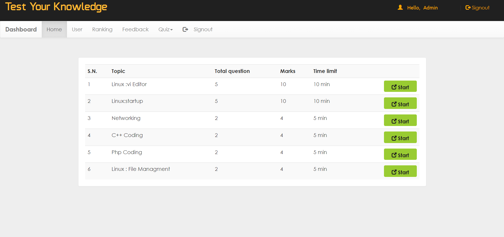

Brief overview of the technologies used: 

Front end: HTML, CSS, JavaScript  HTML: HTML is used to create and save web document. 
CSS : (Cascading Style Sheets) Create attractive Layout 
JavaScript: it is a programming language, commonly use with web browsers. 

Back end: PHP, MySQL  
PHP: Hypertext Preprocessor (PHP) is a technology that allows software developers to create dynamically generated web pages, in HTML, XML, or other document types, as per client request. PHP is open source software. 

MySQL: MySql is a database, widely used for accessing querying, updating, and managing data in databases. 

  
  
  

